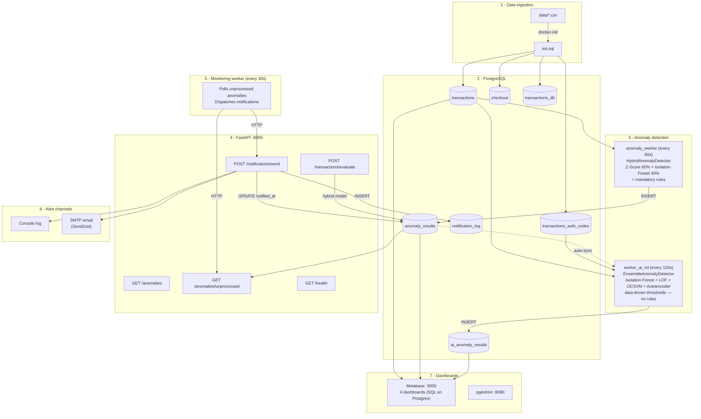

# CloudWalk Transaction Monitoring System

A near-real-time transaction monitoring and anomaly detection system built for CloudWalk's Monitoring Analyst challenge. It ingests payment transaction data, detects anomalies using two independent approaches — a **rule-based hybrid model** (Z-Score + Isolation Forest + mandatory business rules) and a **pure ML ensemble** (Isolation Forest + Local Outlier Factor with data-driven thresholds) — and sends **automated alerts** (email via SendGrid + console) when denied, failed, or reversed transactions exceed normal levels.

---

## Architecture



Editable diagram: [`docs/architecture.excalidraw`](docs/architecture.excalidraw) (open in [excalidraw.com](https://excalidraw.com) or VS Code Excalidraw extension).  
Printable summary: [`docs/architecture_overview.pdf`](docs/architecture_overview.pdf).

---

## How to run

### Prerequisites

- **Docker Desktop** (includes Docker Compose)
- **Python 3.11+** (for local scripts and dashboard upload)
- **Git**

### Step 1 - Clone the repository

```bash
git clone https://github.com/Matheus-Rodrigues1/cw-ai-challenge-interview
cd cloudwalk-monitoring
```

### Step 2 - Install Python dependencies

All Python dependencies are declared in `requirements.txt` at the project root. Install them once:

```bash
pip install -r requirements.txt
```

This is needed for local scripts (`inject_spike_anomaly.py`, `upload_dashboards.py`, doc generation). Inside Docker the containers install dependencies automatically.

### Step 3 - Configure credentials and email alerts 

Copy the example and fill your credentials:

```bash
cp .env.example .env
```

Edit `.env` with your SendGrid API key (see `.env.example` for details). Without this step everything still runs -- alerts just go to the console log instead of email.

### Step 4 - Start all services

```bash
docker compose up -d --build
```

This starts **7 containers**:

| Container | Port | Purpose |
|-----------|------|---------|
| `postgres_container` | 5432 | PostgreSQL 15 with all data loaded via `init.sql` |
| `pgadmin_container` | 8080 | pgAdmin web UI (login: `admin@admin.com` / `"your_pass"`) |
| `metabase_container` | 3000 | Metabase dashboards (first-time setup required) |
| `monitoring_api` | 8000 | FastAPI — evaluation endpoint + notification dispatch |
| `anomaly_worker` | -- | Rule-based hybrid detection every 60s, writes `anomaly_results` |
| `monitoring_worker` | -- | Polls unprocessed anomalies every 30s, sends alerts |
| `worker_ai_ml` | -- | Pure ML ensemble (IF + LOF + OCSVM + Autoencoder) every 120s, writes `ai_anomaly_results` |

### Step 5 - Verify

```bash
# Health check
curl http://localhost:8000/api/v1/health

# Interactive API docs
 Open http://localhost:8000/docs in a browser

# Evaluate one minute of transactions
curl -X POST http://localhost:8000/api/v1/transactions/evaluate \
  -H "Content-Type: application/json" \
  -d '{"approved":85,"denied":49,"failed":10,"reversed":2,"backend_reversed":9,"refunded":1}'
```

### Step 6 - Upload Metabase dashboards (optional)

After completing Metabase first-time setup at <http://localhost:3000> and adding the `cloudwalk_transactions` database (Admin > Databases > Add database, host = `postgres_db`, port 5432, user/pass = `admin`/`"your_pass"`):

```bash
# Upload all dashboards (rule-based + AI)
METABASE_EMAIL=you@email.com METABASE_PASSWORD=your_pass python metabase/upload_dashboards.py

# Upload only the AI Detection dashboard (other dashboards are untouched)
METABASE_EMAIL=you@email.com METABASE_PASSWORD=your_pass python metabase/upload_dashboards.py --dashboard "CloudWalk — Anomalies with AI Detection"
```

The script is **idempotent** — it detects and deletes any existing dashboard with the same name (including its cards) before recreating it, so re-running never creates duplicates. Use `--dashboard` for isolated updates.

### Step 7 - Test the full alert pipeline

Insert a synthetic spike and watch the workers detect and notify:

```bash
# PowerShell
$env:DB_HOST="localhost"; py -3 scripts/inject_spike_anomaly.py --wait

# bash
DB_HOST=localhost python scripts/inject_spike_anomaly.py --wait
```

Then watch the logs:

```bash
docker compose logs -f anomaly_worker monitoring_worker monitoring_api
```

---

## Environment variables

Docker Compose reads a **`.env`** file in the project root. Copy `.env.example` to `.env` and fill what you need. Variables that already have defaults in `docker-compose.yaml` (DB credentials, ports) do **not** need to be in `.env`.

### Email (in `.env`, consumed by `monitoring_api`)

| Variable | Required? | Example |
|----------|-----------|---------|
| `SMTP_HOST` | Yes | `smtp.sendgrid.net` |
| `SMTP_PORT` | No (default `587`) | `587` |
| `SMTP_SSL` | No | `true` (for port 465) |
| `SMTP_USER` | Yes | `apikey` (SendGrid) |
| `SMTP_PASS` | Yes | `SG.xxxxx` |
| `ALERT_EMAIL_TO` | Yes | `you@gmail.com` |
| `ALERT_EMAIL_FROM` | No | `monitoring@cloudwalk.io` |
| `ALERT_ON_EVALUATE` | No | `true` to auto-notify on `/evaluate` |
| `SMTP_DEBUG` | No | `true` for SMTP transcript in logs |

### Workers (set in `docker-compose.yaml`)

| Variable | Service | Default | Purpose |
|----------|---------|---------|---------|
| `RUN_INTERVAL_SECONDS` | `anomaly_worker` | `60` | Seconds between rule-based detection cycles |
| `API_BASE_URL` | `monitoring_worker` | `http://monitoring_api:8000` | API URL |
| `POLL_INTERVAL_SECONDS` | `monitoring_worker` | `30` | Poll interval |
| `MIN_SCORE_TO_NOTIFY` | `monitoring_worker` | `0.5` | Minimum anomaly score to trigger alert |
| `CRITICAL_CHANNELS` | `monitoring_worker` | `console,email` | Channels for CRITICAL |
| `WARNING_CHANNELS` | `monitoring_worker` | `console,email` | Channels for WARNING |

### AI/ML worker (set in `docker-compose.yaml`)

| Variable | Service | Default | Purpose |
|----------|---------|---------|---------|
| `RUN_INTERVAL_SECONDS` | `worker_ai_ml` | `120` | Seconds between ML detection cycles |
| `RETRAIN_EVERY_N_CYCLES` | `worker_ai_ml` | `5` | Retrain model every N cycles (~10 min) |
| `CONTAMINATION` | `worker_ai_ml` | `0.05` | Expected anomaly fraction fed to IF + LOF + OCSVM + Autoencoder |

### Model tuning (optional, pass to `monitoring_api` environment)

| Variable | Default | Description |
|----------|---------|-------------|
| `Z_THRESHOLD` | `2.5` | Z-score cutoff |
| `ISO_CONTAMINATION` | `0.05` | Isolation Forest expected anomaly rate |
| `ROLLING_WINDOW` | `30` | Minutes for rolling statistics |
| `WARNING_SCORE` | `0.5` | Score threshold for WARNING |
| `CRITICAL_SCORE` | `0.75` | Score threshold for CRITICAL |
| `Z_WEIGHT` | `0.6` | Z-Score weight in final score (Isolation Forest gets `1 - Z_WEIGHT`) |

### Metabase dashboard upload (run from host)

| Variable | Example |
|----------|---------|
| `METABASE_URL` | `http://localhost:3000` |
| `METABASE_EMAIL` | `admin@email.com` |
| `METABASE_PASSWORD` | `password` |
| or `METABASE_API_KEY` | `mb_...` |

---

## API endpoints

Base URL: `http://localhost:8000` -- interactive docs at `/docs` (Swagger UI).

| Method | Endpoint | Description |
|--------|----------|-------------|
| `GET` | `/api/v1/health` | Health check (DB + model status) |
| `POST` | `/api/v1/transactions/evaluate` | Evaluate one minute of counts (hybrid model + mandatory rules) |
| `GET` | `/api/v1/transactions` | Query transactions (filters: `status`, `start`, `end`, `limit`) |
| `GET` | `/api/v1/transactions/summary` | Aggregated stats per status |
| `GET` | `/api/v1/anomalies` | Query anomaly results (filters: `level`, `start`, `end`, `limit`) |
| `GET` | `/api/v1/anomalies/unprocessed` | Anomalies not yet notified |
| `POST` | `/api/v1/anomalies/{id}/acknowledge` | Mark anomaly as notified |
| `POST` | `/api/v1/notifications/send` | Send alert for a specific anomaly ID (console + email) |
| `GET` | `/api/v1/notifications/history` | Past notification log |
| `GET` | `/api/v1/stats` | Aggregated detection statistics |

### Example: evaluate a suspicious minute

```bash
curl -s -X POST http://localhost:8000/api/v1/transactions/evaluate \
  -H "Content-Type: application/json" \
  -d '{"approved":85,"denied":49,"failed":10,"reversed":2,"backend_reversed":9,"refunded":1}' | python -m json.tool
```

Response includes `recommendation`, `mandatory_rule_alerts`, `triggered_rules`, `anomaly_score`, and `alert_level`.

---

## Anomaly detection models

The system runs **two independent detection pipelines** that write to separate tables and are visualised in separate dashboards.

### Rule-based: HybridAnomalyDetector (`anomaly_worker`)

#### Scoring formula

Every minute is scored from 0.0 (normal) to 1.0 (severe anomaly):

```
final_score = 0.6 × z_component  +  0.4 × iso_component
```

| Sub-score | How it is computed |
|-----------|-------------------|
| `z_component` | `min(max_abs_z / 10.0, 1.0)` — largest absolute Z-score across all statuses, capped at 1 |
| `iso_component` | `1 − (raw_IF_score − min) / (max − min)` — Isolation Forest decision function, inverted and min-max normalised so that 1 = most anomalous |

The rolling Z-scores are computed against the **global mean and std** learned from the full training set (all rows in `transactions`).

#### Mandatory business rules

Each of the four rules fires independently when `Z > 2.5` (default `Z_THRESHOLD`):

| Rule ID | Monitored status | Fires when |
|---------|-----------------|------------|
| `ALERT_DENIED_ABOVE_NORMAL` | `denied` | denied Z-score > 2.5 |
| `ALERT_FAILED_ABOVE_NORMAL` | `failed` | failed Z-score > 2.5 |
| `ALERT_REVERSED_ABOVE_NORMAL` | `reversed` | reversed Z-score > 2.5 |
| `ALERT_BACKEND_REVERSED_ABOVE_NORMAL` | `backend_reversed` | backend_reversed Z-score > 2.5 |

There is also a **bonus signal** (not a mandatory rule): if `approved` Z-score < −2.5, an `approved_drop_zscore_<value>` flag is appended to the triggered rules list.

#### Score bump from mandatory rules

After the weighted score is computed, mandatory rules can force the score upward:

| Mandatory rules fired | Score floor applied |
|-----------------------|-------------------|
| 0 | No change — weighted formula stands |
| 1 | `score = max(score, 0.50)` → guaranteed at least WARNING |
| ≥ 2 | `score = max(score, 0.75)` → guaranteed at least CRITICAL |

#### Alert levels and actions

| Level | Score range | `is_anomaly` | Action |
|-------|------------|--------------|--------|
| `NORMAL` | < 0.50 | `false` | No notification |
| `WARNING` | ≥ 0.50 and < 0.75 | `true` | Alert sent to WARNING channels |
| `CRITICAL` | ≥ 0.75 | `true` | Alert sent to CRITICAL channels |

#### Operator recommendations

When a rule fires, `build_recommendation()` generates a human-readable action:

| Triggered rule | Operator guidance |
|----------------|------------------|
| `ALERT_DENIED_ABOVE_NORMAL` | Review auth codes (51 vs 59), issuer behaviour, fraud filters |
| `ALERT_FAILED_ABOVE_NORMAL` | Check processor connectivity, gateway timeouts, error rates |
| `ALERT_REVERSED_ABOVE_NORMAL` / `ALERT_BACKEND_REVERSED_ABOVE_NORMAL` | Review chargebacks, disputes, settlement/backend reversal flows |
| No mandatory rule (score elevated by IF only) | Review technical rules and minute-level volumes |
| Any CRITICAL | Escalate on-call, open incident if sustained |

Results are written to `anomaly_results`.

---

### Alert notifications (`monitoring_worker` + SendGrid)

#### Gate: when a notification is sent

The `monitoring_worker` polls `GET /api/v1/anomalies/unprocessed` every 30 s. An anomaly is notified **only if both conditions hold**:

| Condition | Value |
|-----------|-------|
| `anomaly_score ≥ MIN_SCORE_TO_NOTIFY` | Default **0.5** (configurable via env var) |
| `alert_level` is WARNING or CRITICAL | NORMAL is never notified |

#### Channel routing by severity

| Alert level | Channels used | Default |
|-------------|--------------|---------|
| `CRITICAL` | `CRITICAL_CHANNELS` env var | `console,email` |
| `WARNING` | `WARNING_CHANNELS` env var | `console,email` |

Available channel values: `console`, `email`, `slack`.

#### Email via SendGrid — prerequisites

Email is only dispatched if **all three** of these env vars are set and non-empty:

```
SMTP_HOST      (e.g. smtp.sendgrid.net)
SMTP_PASS      (SendGrid API key, e.g. SG.xxxxx)
ALERT_EMAIL_TO (recipient address)
```

`SMTP_USER` must be the **literal string `apikey`** for SendGrid (not your account email).

#### Email content

```
Subject : [CRITICAL] CloudWalk Transaction Alert - 2025-07-13 14:32:00
Body    :
  [CRITICAL] Transaction Anomaly Detected
  Timestamp    : 2025-07-13 14:32:00
  Anomaly Score: 0.831
  Triggered Rules: ALERT_DENIED_ABOVE_NORMAL, ALERT_FAILED_ABOVE_NORMAL
  Counts: {"approved": 40, "denied": 120000, "failed": 35000, ...}
```

#### SMTP protocol selection

| `SMTP_PORT` | `SMTP_SSL` env var | Protocol used |
|-------------|-------------------|--------------|
| 587 (default) | unset / false | STARTTLS (`SMTP` + `starttls()`) |
| 465 | `true` | Implicit TLS (`SMTP_SSL`) |

#### Slack (optional)

Set `SLACK_WEBHOOK_URL` to enable. The Slack message includes a colour-coded attachment (red = CRITICAL, orange = WARNING) with timestamp, score, triggered rules, and per-status counts.

---

### Pure ML: EnsembleAnomalyDetector (`worker_ai_ml`)

Runs entirely independently — no hardcoded thresholds, no business rules:

| Component | How it works |
|-----------|--------------|
| **Isolation Forest** | Tree-based outlier scoring; learns global anomalies |
| **Local Outlier Factor** | Density-based; catches anomalies relative to local neighbours |
| **One-Class SVM** | Kernel-based boundary; learns a decision frontier around normal data |
| **Autoencoder** | MLPRegressor trained to reconstruct input; reconstruction error = anomaly signal |
| **Ensemble** | Equal-weight mean of min-max-normalised IF + LOF + OCSVM + Autoencoder scores |

Features include raw counts, rate features (denial\_rate, failure\_rate, reversal\_rate), **cyclical time encoding** (hour/day-of-week as sin/cos pairs), 30-min rolling stats, and auth-code diversity metrics.

**Adaptive thresholds** — WARNING and CRITICAL boundaries are the P75 and P90 of ensemble scores computed on the training set itself, and are recalculated on every retrain. Results are written to `ai_anomaly_results`.

**Auto-sync with rule-based pipeline** — every cycle the AI worker cross-references `anomaly_results` (rule-based) with `ai_anomaly_results` via a `LEFT JOIN` to detect timestamps present in one but missing from the other. For each gap, if feature data is available in `monitoring_minute_pivot` it runs the full AI ensemble; otherwise it mirrors the rule-based result as a fallback. This guarantees the AI dashboard stays in lock-step with manual inserts and the rule-based pipeline without any operator intervention.

### Alert levels (both pipelines)

| Alert level | Score range | Action |
|-------------|------------|--------|
| `NORMAL` | < threshold\_warning | No action |
| `WARNING` | ≥ threshold\_warning | Monitor closely |
| `CRITICAL` | ≥ threshold\_critical | Immediate escalation |

> For the rule-based pipeline the thresholds are fixed at 0.50 / 0.75. For the ML pipeline they are learned from each training run.

---

## Metabase dashboards

Four dashboards in total — all defined in [`metabase/Dashboards/manifest.json`](metabase/Dashboards/manifest.json):

1. **Anomaly monitoring** — anomaly score timeline, alert distribution, CRITICAL table, pending notifications *(queries `anomaly_results`)*
2. **CloudWalk — Transactions & operational data** — approved/denied per hour, auth codes 51/59, checkout, OpInt volume
3. **Minute monitoring** — denied/failed/reversed per minute with 60-minute rolling averages
4. **CloudWalk — Anomalies with AI Detection** — AI score timeline, per-model breakdowns (IF/LOF/OCSVM/Autoencoder), AI vs rule-based benchmarking, alert distribution, CRITICAL table, hourly counts *(queries `ai_anomaly_results`)*

---

## Dataset overview (Task 3.1)

| File | Records | Granularity | Purpose |
|------|---------|-------------|---------|
| `transactions.csv` | 25,920 | Per minute | Transaction status counts (Jul 12--15, 2025) |
| `transactions_auth_codes.csv` | 12,960 | Per minute | Auth code breakdown |
| `checkout_1.csv` / `checkout_2.csv` | 24 each | Per hour | POS sales (baseline + anomaly) |
| `operational_intelligence_transactions_db.csv` | 62,034 | Per day | Full transaction database (Jan--Mar 2025) |

Static analysis report: [`docs/cloudwalk_monitoring_report.pdf`](docs/cloudwalk_monitoring_report.pdf).

---

## Project structure

```
cloudwalk-monitoring/
├── docker-compose.yaml           # 7 services: postgres, pgadmin, metabase, api, 3 workers
├── Dockerfile.api                # FastAPI image (Python 3.11-slim)
├── Dockerfile.worker             # Worker image (anomaly, AI/ML, monitoring)
├── requirements.txt              # Python dependencies (all services)
├── .env.example                  # Template for SendGrid SMTP / optional vars
├── .gitignore
│
├── docker-init/
│   └── 01-create-metabase-db.sh  # Creates metabase_appdb on first Postgres init
│
├── data/                         # CSV sources (mounted as /csv_data in Postgres)
│   ├── transactions.csv
│   ├── transactions_auth_codes.csv
│   ├── checkout_1.csv
│   ├── checkout_2.csv
│   └── operational_intelligence_transactions_db.csv
│
├── src/
│   ├── api/
│   │   ├── main.py               # FastAPI app (11 endpoints)
│   │   ├── database.py           # Postgres connection pool (psycopg2)
│   │   └── notifications.py      # AlertNotifier: console + SendGrid SMTP email
│   ├── models/
│   │   ├── anomaly_detector.py   # HybridAnomalyDetector (Z-Score + Isolation Forest)
│   │   └── monitoring_rules.py   # Mandatory rules: denied/failed/reversed above normal
│   └── workers/
│       ├── anomaly_worker.py     # Rule-based loop: fit model, evaluate new minutes, write DB
│       ├── monitoring_worker.py  # Notification loop: poll API, send alerts per channel
│       └── ai_ml_worker.py       # Pure ML loop: IF + LOF + OCSVM + Autoencoder ensemble, writes ai_anomaly_results
│
├── sql/
│   ├── init.sql                  # Schema (incl. ai_anomaly_results) + COPY + monitoring views
│   └── monitoring_organized.sql  # View definitions reference
│
├── scripts/
│   ├── inject_spike_anomaly.py   # Insert test spike + optional --wait for API
│   └── deploy-aws.sh             # One-command AWS deployment (infra + images + seed)
│
├── terraform/                    # AWS IaC — ECS Fargate, RDS, ALB, ECR, CloudWatch
│   ├── main.tf, variables.tf, outputs.tf
│   ├── vpc.tf, security_groups.tf, rds.tf
│   ├── ecr.tf, iam.tf, secrets.tf
│   ├── ecs.tf, alb.tf, cloudwatch.tf
│   └── terraform.tfvars.example
│
├── metabase/
│   ├── Dashboards/
│   │   └── manifest.json         # All dashboard definitions (4 dashboards, 32 cards)
│   └── upload_dashboards.py      # Idempotent upload (supports --dashboard filter)
│
├── docs/
│   ├── architecture.excalidraw   # System diagram (regenerate: py -3 docs/build_architecture_diagram.py)
│   ├── architecture_overview.pdf # Architecture + env reference (regenerate: py -3 docs/generate_architecture_pdf.py)
│   ├── cloudwalk_monitoring_report.pdf  # Static EDA report (Task 3.1)
│   ├── build_architecture_diagram.py
│   └── generate_architecture_pdf.py
│
└── .vscode/
    ├── extensions.json
    └── settings.json
```

---

## Useful commands

```bash
# Start everything (7 containers)
docker compose up -d --build

# Stop everything
docker compose down

# View logs (all services)
docker compose logs -f

# View only rule-based detection + notification logs
docker compose logs -f anomaly_worker monitoring_worker monitoring_api

# View AI/ML worker logs
docker compose logs -f worker_ai_ml

# Re-run init.sql on existing DB (PowerShell)
Get-Content -Raw -Encoding UTF8 .\sql\init.sql | docker compose exec -T postgres_db psql -U admin -d cloudwalk_transactions

# Re-run init.sql on existing DB (bash)
docker compose exec -T postgres_db psql -U admin -d cloudwalk_transactions < sql/init.sql

# Rebuild only the AI/ML worker after code changes
docker compose up -d --build --force-recreate worker_ai_ml

# Upload all dashboards (idempotent — deletes and recreates if they already exist)
METABASE_EMAIL=you@email.com METABASE_PASSWORD=your_pass python metabase/upload_dashboards.py

# Upload only the AI dashboard (isolated, other dashboards untouched)
METABASE_EMAIL=you@email.com METABASE_PASSWORD=your_pass python metabase/upload_dashboards.py --dashboard "CloudWalk — Anomalies with AI Detection"

# Regenerate architecture artefacts
py -3 docs/build_architecture_diagram.py
py -3 docs/generate_architecture_pdf.py
```

---

## AWS Deployment (Terraform)

The `terraform/` directory contains a full Infrastructure-as-Code setup to deploy the entire stack on **AWS** using ECS Fargate (serverless containers), RDS PostgreSQL, and ALB.

### What gets created

| AWS Resource | Replaces (docker-compose) | Details |
|---|---|---|
| **RDS PostgreSQL 15** | `postgres_db` | Managed database, encrypted, automatic backups |
| **ECS Service — API** | `monitoring_api` | Fargate, behind ALB, auto-scaling (2-6 tasks) |
| **ECS Service — Anomaly Worker** | `anomaly_worker` | Fargate, 1 task |
| **ECS Service — Monitoring Worker** | `monitoring_worker` | Fargate, 1 task |
| **ECS Service — AI/ML Worker** | `worker_ai_ml` | Fargate, 1 task |
| **ECS Service — Metabase** | `metabase` | Fargate, behind ALB on port 80 |
| **ALB** | `localhost:8000` / `:3000` | Public load balancer (API on :8000, Metabase on :80) |
| **ECR** | local images | Container registry for API and Worker images |
| **VPC + Subnets** | Docker network | Public + private subnets across 2 AZs |
| **Secrets Manager** | `.env` file | DB password, SMTP credentials, Slack webhook |
| **CloudWatch Logs** | `docker compose logs` | Centralized logging with 30-day retention |
| **Service Discovery** | Docker DNS | Private DNS for inter-service communication |

### Prerequisites

- **AWS CLI** configured (`aws configure`)
- **Terraform** >= 1.5
- **Docker** (for building/pushing images)

### Deploy

```bash
# 1. Configure variables
cd terraform
cp terraform.tfvars.example terraform.tfvars
# Edit terraform.tfvars with your values (at minimum: db_password)

# 2. Initialize and apply
terraform init
terraform plan
terraform apply

# 3. Build and push Docker images to ECR
$(terraform output -raw ecr_login_command)

docker build -f ../Dockerfile.api -t $(terraform output -raw ecr_api_url):latest ..
docker push $(terraform output -raw ecr_api_url):latest

docker build -f ../Dockerfile.worker -t $(terraform output -raw ecr_worker_url):latest ..
docker push $(terraform output -raw ecr_worker_url):latest

# 4. Run the DB seed task (creates metabase_appdb database)
# See: terraform output run_db_seed_command

# 5. Load schema + data into RDS
# Connect to RDS and run sql/init.sql (use psql, pgAdmin, or a bastion host)
```

Or use the convenience script:

```bash
chmod +x scripts/deploy-aws.sh
./scripts/deploy-aws.sh          # full deploy (infra + images + seed)
./scripts/deploy-aws.sh infra    # terraform only
./scripts/deploy-aws.sh images   # build + push images only
```

After deployment, Terraform outputs the URLs:

```bash
terraform output api_url        # → http://<alb-dns>:8000/api/v1
terraform output metabase_url   # → http://<alb-dns>
terraform output rds_endpoint   # → <rds-host>:5432
```

### Terraform files

```
terraform/
├── main.tf                  # Provider, backend, data sources, locals
├── variables.tf             # All input variables
├── vpc.tf                   # VPC, subnets, NAT Gateway, Service Discovery
├── security_groups.tf       # ALB, ECS, RDS security groups
├── rds.tf                   # PostgreSQL 15 managed instance
├── ecr.tf                   # Container registries + lifecycle policies
├── iam.tf                   # ECS execution + task IAM roles
├── secrets.tf               # Secrets Manager (DB, SMTP, Slack)
├── ecs.tf                   # Cluster, 5 task definitions, 4 services, auto-scaling
├── alb.tf                   # Load balancer, target groups, listeners
├── cloudwatch.tf            # Log groups
├── outputs.tf               # URLs, commands, resource IDs
├── terraform.tfvars.example # Template — copy to terraform.tfvars
└── .gitignore
```

### Cost estimate (us-east-1, minimal config)

| Resource | Approx. monthly cost |
|---|---|
| RDS db.t3.micro (single-AZ) | ~$15 |
| NAT Gateway | ~$32 |
| ALB | ~$16 |
| ECS Fargate (4 tasks) | ~$40-60 |
| ECR + CloudWatch + Secrets | ~$2-5 |
| **Total** | **~$105-128/mo** |

> For production, upgrade to `db.t3.small` + Multi-AZ (~$60/mo for RDS) and increase `api_desired_count`.

---

## License

This project was created as part of the CloudWalk Monitoring Analyst technical assessment.
